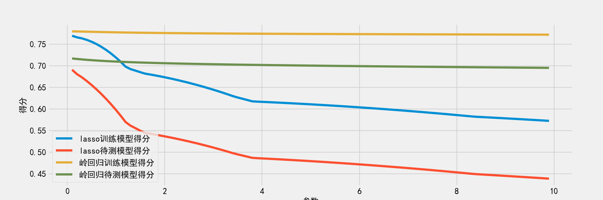

## Lasso / Ridge 回归

### 数据集

老样子首先读取数据集。这次使用的是 csv 文件来
存放数据。根据我的使用感受，还是这种表格形式的数据存储格式更多一些、
更稳定一些。

```python
import pandas as pd
house_price = pd.read_csv('HousingData.csv')
```

到这里就可以直接读出数据：
```python
        CRIM    ZN  INDUS  CHAS    NOX  ...  TAX  PTRATIO       B  LSTAT  MEDV
0    0.00632  18.0   2.31   0.0  0.538  ...  296     15.3  396.90   4.98  24.0
1    0.02731   0.0   7.07   0.0  0.469  ...  242     17.8  396.90   9.14  21.6
2    0.02729   0.0   7.07   0.0  0.469  ...  242     17.8  392.83   4.03  34.7
3    0.03237   0.0   2.18   0.0  0.458  ...  222     18.7  394.63   2.94  33.4
4    0.06905   0.0   2.18   0.0  0.458  ...  222     18.7  396.90    NaN  36.2
..       ...   ...    ...   ...    ...  ...  ...      ...     ...    ...   ...
501  0.06263   0.0  11.93   0.0  0.573  ...  273     21.0  391.99    NaN  22.4
502  0.04527   0.0  11.93   0.0  0.573  ...  273     21.0  396.90   9.08  20.6
503  0.06076   0.0  11.93   0.0  0.573  ...  273     21.0  396.90   5.64  23.9
504  0.10959   0.0  11.93   0.0  0.573  ...  273     21.0  393.45   6.48  22.0
505  0.04741   0.0  11.93   0.0  0.573  ...  273     21.0  396.90   7.88  11.9

[506 rows x 14 columns]

Process finished with exit code 0

```
这个数据是来自于 kaggle 上的“波士顿房价”，里面数据可能有些瑕疵，
可能是故意做出来给参赛选手做处理的。所以还是要做一下数据清洗。

### 数据清洗
数据清洗基本上只能是删掉了，不删的话也不知道该怎么处理好。
```python
house_price = house_price.dropna().reset_index()
```
这样一下来只剩下`[394 rows x 15 columns]`的数据了。
print 之后发现还有个 index 列，也是要删掉的。这么一看，Dataframe的操作还真是比单纯的 torch 操作方便啊...
```python
del house_price["index"]
```
看了 Kaggle 上别人做的才发现， MEDV 这列是表示房价，也就是我们的 target...
所以这里在 dataset 中把这一列删掉，将它作为 traget / labels 单独提出来。
```python
train = house_price.drop(["MEDV"],axis=1)
```

这个大佬还通过一顿数据分析发现【"RAD" and "TAX" columns are highly correlated which means multicollinearity is present so we have to remove one column.】
有兴趣的话可以删掉一行，但因为不是我发现的，我就不照搬了。。。
### 模型程序
接下来就是正题了。
```python
train = house_price.drop(["MEDV"],axis=1)
target = house_price["MEDV"]
X_train,X_test,y_train,y_test = train_test_split(train,target)
lasso = Lasso(alpha=0.5,max_iter=1000)
lasso.fit(X_train,y_train)
```
既然别人造好轮子了我们就不重复造轮子了。
运行以上代码之后，使用`sklearn`中自带的 r_2 score，可以看到模型的估计分数。
```python
print("Lasso训练模型得分："+str(r2_score(y_train,lasso.predict(X_train))))
print("Lasso待测模型得分："+str(r2_score(y_test,lasso.predict(X_test))))
# Lasso训练模型得分：0.7641341531329282
# Lasso待测模型得分：0.6665912197712046
```
优化这个模型的话，可以从上面的数据处理操作开始。但是因为已经跑起来了，这里就先进一步考虑和 Ridge的比较。

```python
ridge = Ridge(alpha=0.5)
ridge.fit(X_train,y_train)
print("Lasso训练模型得分："+str(r2_score(y_train,ridge.predict(X_train))))
print("Lasso待测模型得分："+str(r2_score(y_test,ridge.predict(X_test))))
# Lasso训练模型得分：0.7581185380222839
# Lasso待测模型得分：0.775400839981849
```
基本的工作的话，到这里就结束了。但是在大佬的启发下，我进一步做了一下直观的数据比较。
这一部分的代码就不是我写的了。（严格意义上来说，前面的代码也不是我写的。。）

```python
result=pd.DataFrame(columns=["参数","lasso训练模型得分","lasso待测模型得分","岭回归训练模型得分","岭回归待测模型得分"])
for i in range(1,100):
    alpha=i/10
    ridge=Ridge(alpha=alpha)
    lasso=Lasso(alpha=alpha,max_iter=10000)
    ridge.fit(X_train,y_train)
    lasso.fit(X_train,y_train)
    result=result.append(
        [{"参数":alpha,
          "lasso训练模型得分":r2_score(y_train,lasso.predict(X_train)),
          "lasso待测模型得分":r2_score(y_test,lasso.predict(X_test)),
          "岭回归训练模型得分":r2_score(y_train,ridge.predict(X_train)),
          "岭回归待测模型得分":r2_score(y_test,ridge.predict(X_test))}
         ])

import matplotlib.pyplot as plt
import seaborn as sns
plt.style.use("fivethirtyeight")
sns.set_style({'font.sans-serif':['SimHei','Arial']})#设定汉字字体，防止出现方框
# matplotlib inline
#在jupyter notebook上直接显示图表
fig= plt.subplots(figsize=(15,5))
plt.plot(result["参数"],result["lasso训练模型得分"],label="lasso训练模型得分")#画折线图
plt.plot(result["参数"],result["lasso待测模型得分"],label="lasso待测模型得分")
plt.plot(result["参数"],result["岭回归训练模型得分"],label="岭回归训练模型得分")
plt.plot(result["参数"],result["岭回归待测模型得分"],label="岭回归待测模型得分")
plt.rcParams.update({'font.size': 15})
plt.legend()
plt.xticks(fontsize=15)#设置坐标轴上的刻度字体大小
plt.yticks(fontsize=15)
plt.xlabel("参数",fontsize=15)#设置坐标轴上的标签内容和字体
plt.ylabel("得分",fontsize=15)
plt.show()
```
这块的意义实际上是通过观察不同惩罚项系数对模型精度的影响与比较。运行这段函数后可以马上得到如下结果：


这些操作能够使用了之后，这两个回归函数工具也可以熟练使用了。主要还是在于数据集的读取，需要些熟练度。